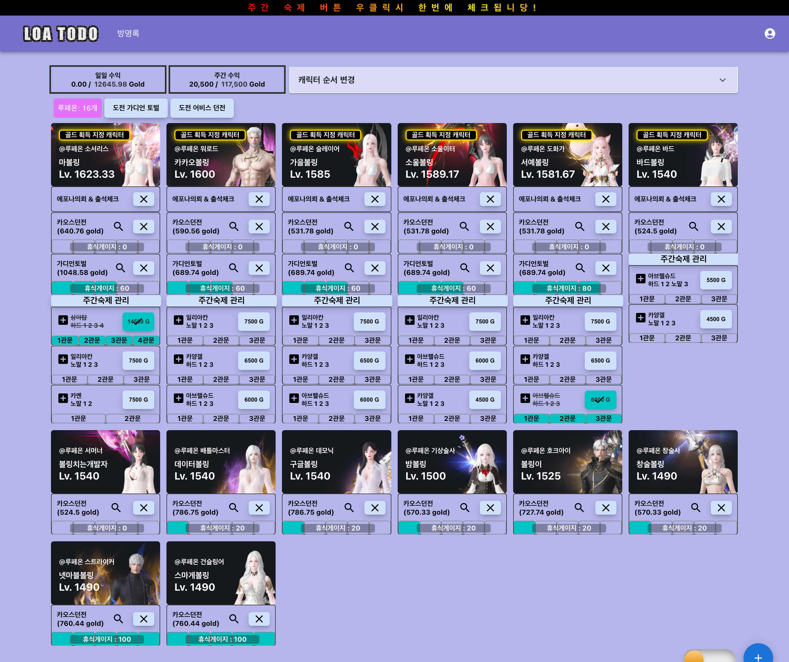
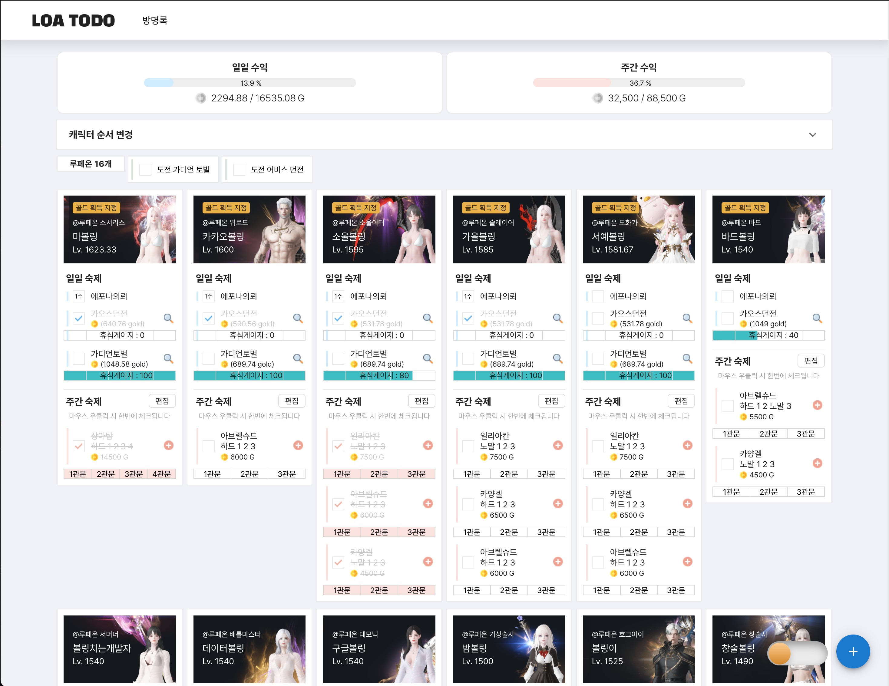

# 로스트아크 숙제 체크 사이트
## https://app.loatodo.com

## Github
- [Backend](https://github.com/minhyeok2487/LostarktTodoBackend)
- [Frontend](https://github.com/minhyeok2487/LostarkTodoFrontend)
- [Frontend-Publisher](https://github.com/leehanbee35/LostarkTodoFrontend.git)

## 프로젝트
### 개요
- 로스트아크 일일, 주간 컨텐츠 관리 사이트
    - 일일 컨텐츠 : 카오스 던전, 가디언 토벌, 에포나 의뢰
        - 로스트아크 오픈 API의 거래소, 경매장 등의 데이터를 호출해 예상 수익 계산
        - 체크한 내용을 바탕으로 휴식게이지 계산 -> 인게임과 동일한 휴식게이지
    - 주간 컨텐츠 : 군단장 레이드, 어비스 던전, 어비스레이드
        - 주간 수익 계산
        - 몇 개의 2주 주기 컨텐츠 계산
- 컨텐츠 완료 한 기록 저장 -> 달력식으로 보기
- 주간숙제 고정팟 관리 -> 접속시간 기록 바탕으로 고정팟 추천

### 인원
* 개발자 1 (백엔드 & 프론트) PM
* 퍼블리셔 1 (2023.10.12~)

### 기간
* 2023.08.02 ~ 2023.09.10(기본 기능 개발)
* 2023.09.11 베타 버전 배포
* 2023.10.10 메인 기능(숙제 관리) 배포 완료

### 배포기록
* https://www.inven.co.kr/board/lostark/4821?name=nicname&keyword=Dev&eq=1&iskin=

### 퍼블리싱 진행중 
#### 이전

#### 수정중
