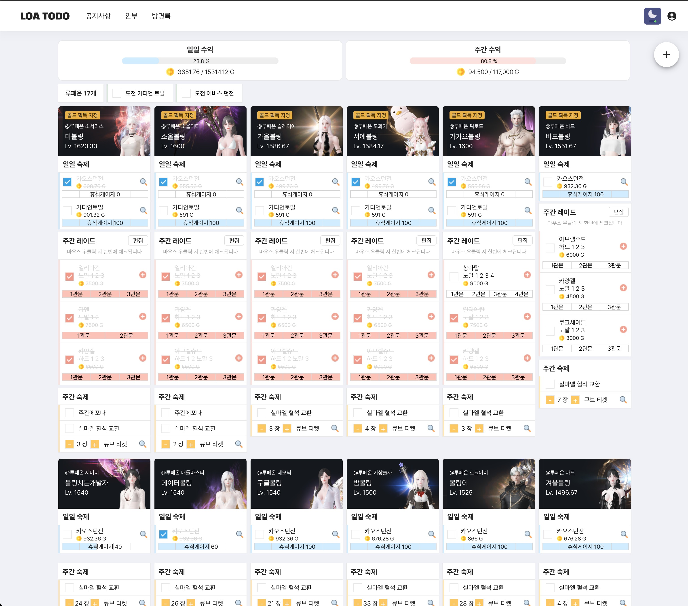

# 로스트아크 일정 관리 사이트 LoaTodo
## https://loatodo.com

## Github
- [Backend](https://github.com/minhyeok2487/LostarktTodoBackend)
- [Frontend](https://github.com/minhyeok2487/LostarkTodoFrontend)
- [Frontend-Publisher](https://github.com/leehanbee35/LostarkTodoFrontend.git)

## 프로젝트
### 개요
- 로스트아크 일일, 주간 컨텐츠 관리
    - 일일 컨텐츠 : 카오스 던전, 가디언 토벌, 에포나 의뢰
        - 로스트아크 오픈 API의 거래소, 경매장 등의 데이터를 호출해 예상 수익 계산
        - 체크한 내용을 바탕으로 휴식게이지 계산 -> 인게임과 동일한 휴식게이지
    - 주간 컨텐츠 : 군단장 레이드, 어비스 던전, 어비스레이드
        - 주간 수익 계산
        - 몇 개의 2주 주기 컨텐츠 계산
- 깐부 기능
  - 권한 있는 상대방의 컨텐츠도 관리

### 인원
* 개발자 1 (백엔드 & 프론트) PM
* 퍼블리셔 1 (2023.10.12~)

### 기간
* 2023.08.02 ~ 2023.09.10(기본 기능 개발)
* 2023.09.11 베타 버전 배포
* 2023.10.10 메인 기능(숙제 관리) 배포 완료
* 2023.12.01 깐부(친구) 기능 추가 완료

### 배포기록(로스트아크 인벤 팁과 노하우 게시판)
* https://www.inven.co.kr/board/lostark/4821?name=nicname&keyword=Dev&eq=1&iskin=

### 화면

---
# 프로젝트 경로
## 기본 파일 명
- **boards** : 공지사항
- **comments** : 방명록
- **friends** : 깐부
- **member** : 로그인 / 회원가입
- **search** : 검색(임시)
- **todo** : 일일 / 주간 숙제

## apis - 백엔드 통신을 위한 api 모음
- **api.js** : 기본 설정 api
- **boards.js** : 공지사항 api
  - 등록, 수정, 삭제 api 만들어야함
  - 권한 확인 기능 추가 해야함

## components - 화면 출력 부분
- **boards** : 기본 BoardMain
- **comments** : 기본 CommentWrap
- **todo** : 기본 TodoMain

## containers - 화면 기능 부분
- **boards** : 기본 BoardListContainer
- **comments** : 기본 CommentListContainer
- **todo**: 기본 TodoContainer

